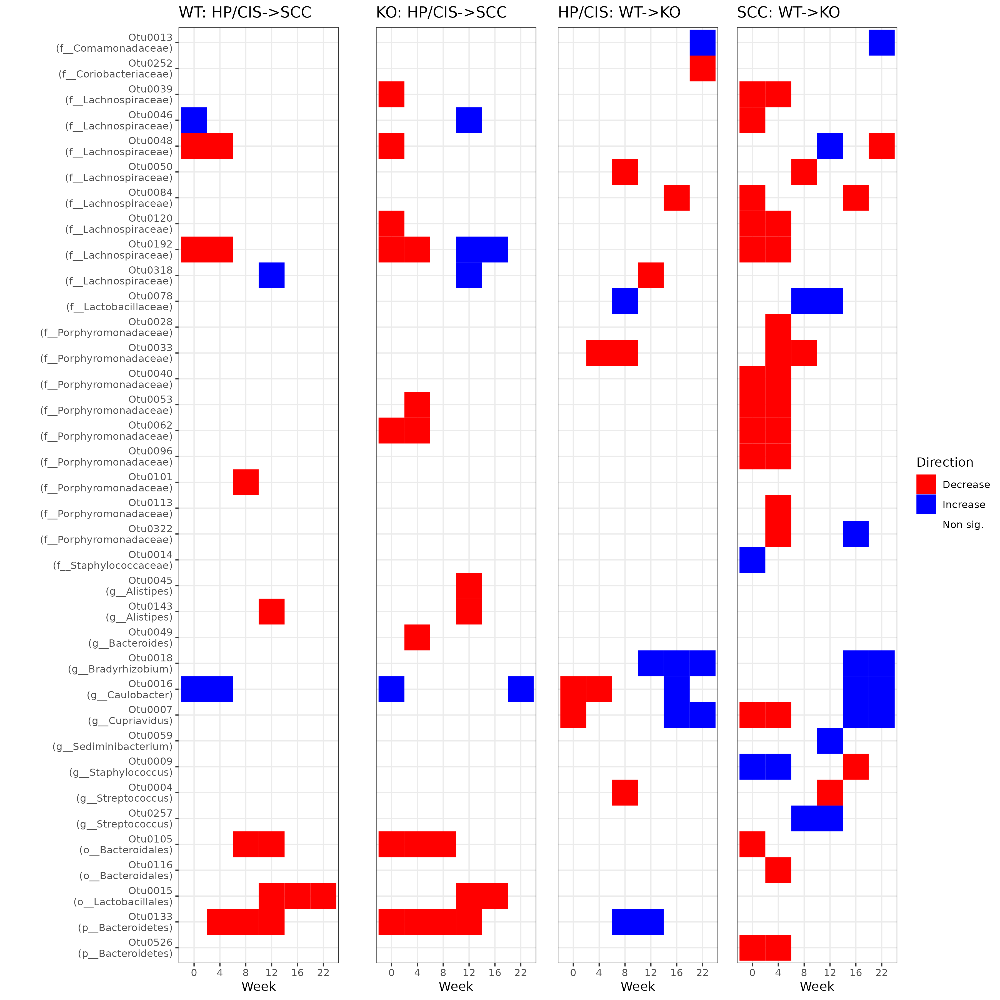

  
```{r setup, include=FALSE}
knitr::opts_chunk$set(echo=TRUE, message=FALSE, warning=FALSE, cache=TRUE, fig.width=10)

# ==============================================================================
# Required packages
library(tidyverse)
library(magrittr)
library(dplyr)
theme_set(theme_minimal())
# ==============================================================================
```


## Coefficient matrix

**How to read this figures**

- x-axis: weeks
- y-axis: Otu (+best taxonomy available) showing a significant difference in either of the two plots
- columns:  model coefficients
- cells: whether the coefficient is sig. positive (blue), sig. negative (red) or non-sig. (empty)

**Model**

$$
    y(t)
    \sim
    \beta_{hp/cis}(t) + \beta_{scc}(t)\mathbb I[scc]
    + \beta_{ko}(t)\mathbb I[ko] + \beta_{scc:ko}\mathbb I[scc, ko]
    + \alpha\mathbb I[Female]
$$
- $\beta_{scc}$: main effect of HP/CIS vs SCC
- $\beta_{ko}$: main effect of WT vs KO
- $\beta_{ko:scc}$: interaction between the two

**Results**

Few OTUs show an interaction between histopathology and genotype. When there is 
an interaction, it appears to be most often in the first 4 weeks, with some exceptions.
Interpreting the direction is difficult; the next figure is more intuitive.


## Group differences matrix

**How to read this figures**

- columns: group differences when one attribute changes
- visual clues: first two columns show the difference HP/CIS->SCC within either genotypes; last 
two columns show the change WT->KO within either histopathologies
- naming convention: X: Y1->Y2 means that we are displaying the difference in going from
group Y1 to Y2 within group X

**Results**

The main thing that jumps to the eye is in SCC: WT->KO, where we see many significant differences in 
the first four weeks. It is mostly decreases, except for Otu0009 (Genus *Staphylococcus*, notice also Otu0014).

Family *Porphyromonadaceae* shows a pretty homogeneous pattern over time; family *Lachnospiraceae* less.


