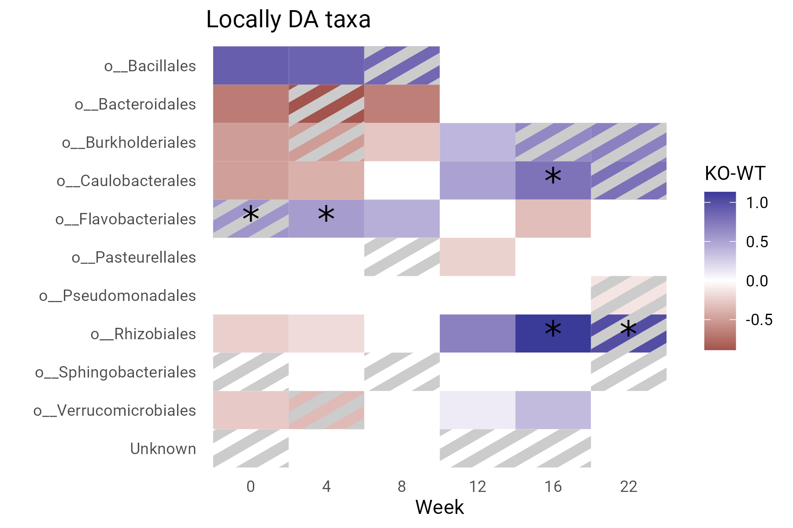
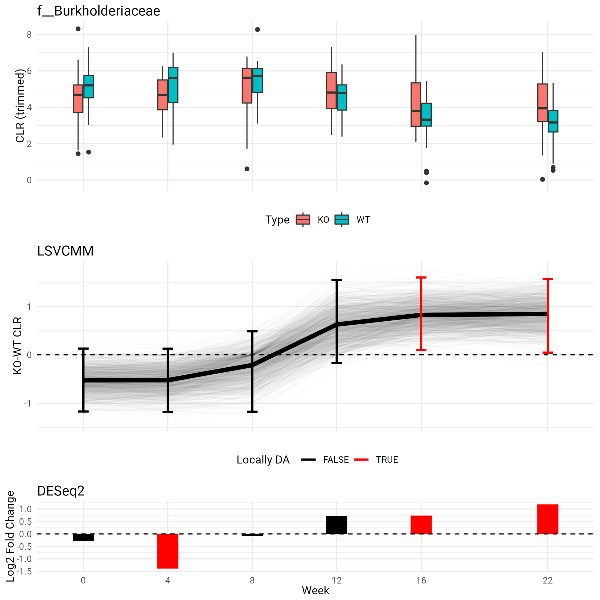

  
```{r setup, include=FALSE}
knitr::opts_chunk$set(echo=TRUE, message=FALSE, warning=FALSE, cache=TRUE, fig.width=8)

# ==============================================================================
# Required packages
library(tidyverse)
library(magrittr)
library(dplyr)
theme_set(theme_minimal())
# ==============================================================================
```

## Data description

We were provided with the following data:

- Saliva sample OTU count table: 294 samples across 1726 OTUs
- Subject ID: 65 subjects
- Subject type: *wild type* (WT) or *knock-out* (KO)
- Subject sex: M or F
- Subject diagnosis: 1, 2, or 3
- Sample time (in weeks): 0, 4, 8, 12, 16, 22, where not all subject were measured at all time points
- Taxonomic information for each OTU

OTU counts were **aggregated** at three different taxonomic levels: 
*genus* (169 taxa), *family* (106 taxa) and *order* (55 taxa).
OTU counts were transformed using the *centered log-ratio* (**clr**) transformation where zero counts
were replaced by a pseudo count of 0.5.

## Goals

1. Identify, if any, which taxa are **differentially abundant** (DA) between the two groups
2. Identify, if any, the **time points** at which the two groups are differentially abundant

## Model description

### Notation

- $i$ indexes subjects
- $x_i=0/1$ encodes subject type (1=KO)
- $u_i=0/1$ encodes subject sex (1=F)
- $y_{ij}(t)$ is the clr-transformed count for taxa $j$ at time $t$

### Fixed effect I: varying-coefficient model

We assume that each group has its own mean trajectory function. To emphasize the DA
problem, we opt for the following parameterization:

- The WT group has mean function $\beta_0(t)$
- The KO group has mean function $\beta_0(t)+\beta_1(t)$

In particular, $\beta_1(t)$ is the quantity of interest: when $\beta_1(t)=0$, then
we can conclude that the taxa under consideration is not DA at time $t$. 

We can specify the mean for subject $i$ as

$$
    \beta_0(t) + x_i\beta_1(t)
$$

### Fixed effect II: non-varying effect

To adjust for potential variability across sex, we include $u_i$ as a constant effect:

$$
    \beta_0(t) + x_i\beta_1(t) + u_i\alpha
$$


### Random effect: subject-specific random intercept

To account for longitudinal correlation between samples of a given subject, 
we include a random intercept $\gamma_i$ that is taken to be constant across time.
The final mean is given by the conditional mean

$$
   \mu_{ij}(t):=\mathbb E\{y_{ij}(t) \mid \gamma_i \} 
   =
    \beta_{0j}(t) + x_i\beta_{1j}(t) + u_i\alpha_j + \gamma_i
$$

with a homoskedastic and conditional independence (given random intercept) assumption across subjects and time points:

$$
    y_{ij}(t) \mid \gamma_i \sim \mathcal N(\mu_{ij}(t), \sigma_j^2)
$$

## Overview of the estimation procedure

Our proposed method combines the following elements:

- Varying coefficients to model longitudinal relationships along covariates (here: two groups)
- Constant effects (here: sex)
- Random effects (here: random intercept)
- Sparse estimation (here: to encourage 0s in $\beta_1(t)$)

In particular, it enables:

- Smooth estimated curves across time
- Local (& global) differential analysis
- Adjustment for other covariates
- Adjustment for dependence across samples
- Irregular sampling time

### Intuition

In contrast to performing DA analysis at each time point idenpendently, our proposed approach
can potentially borrow strength across adjacent time points. 
Conversely, smoothing neighboring time points can potentially avoid some false positive.
This interpretation relies on the underlying assumption that **abundance varies smoothly** with time.

### Pipeline

For each taxa $j$:

1. Fit the model across a grid of tuning parameters (smoothness and sparsity)
2. Tuning parameter selection using an information criterion 
3. Bootstrapping to obtain uncertainty quantification
4. Conclude to local DA whenever the pointwise simultaneous confidence band excludes 0

## Results

We select all taxa for which we identified local DA or cross-sectionally DA at at least one week. 
Blue cells indicate a log-fold increase from WT to KO; red cells indicate a log-fold
decrease from WT to KO. Cells with an asterix (*) indicate that our method identified local DA;
cells with grey stripes indicate that the cross-sectional test indentifies local DA.

### Genus level


### Family level


### Order level




## Taxa-level results

For each taxa previously reported, we produce a plot with three components:

1. A boxplot of the observed clr-transformed counts stratified by time and type
(note that some outliers prevented a reasonable display, so values were trimmed)
2. The estimated difference between the two groups, where positive values represent a log-fold increase from WT to KO.
The plot also contains the bootstrap samples (faint lines) as well as pointwise simultaneous confidence intervals.
Black intervals represent non-DA; red intervals represent local DA.
3. The results for DESeq2, a Negative Binomial test. We display the estimated log-fold change.
If the time point is selected, then it is displayed in red. For a somewhat fair comparison, we 
perform a Bonferroni correction within taxa, across time (i.e., times 6).

### Taxa selected at the genus level


### Taxa selected at the family level




### Taxa selected at the order level


